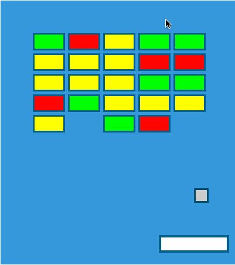

# breakout-phaser



TODO - details...

Based on start point code from [Gus Suarez](https://github.com/aerze/breakout).

Play it [here](https://simonprickett.github.io/breakout-phaser/).

## Setup

Clone repo then:

```
cd breakout-phaser
npm install
npm start
```

Browse to `http://localhost:8080/`.

## Controls

Move the bat using the left and right cursor keys, or go old skool using A for left and D for right.
